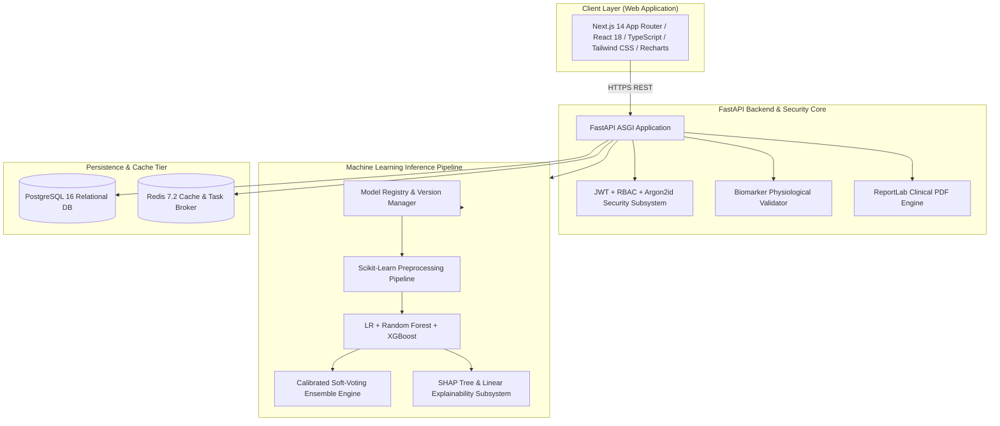

# PulsePredict AI - Enterprise Health Risk Assessment Platform

[](https://opensource.org/licenses/MIT)
[](https://www.python.org/)
[](https://fastapi.tiangolo.com/)
[](https://nextjs.org/)
[](https://www.postgresql.org/)
[](https://www.docker.com/)

**PulsePredict AI** is a production-ready, full-stack clinical decision support and health risk stratification platform. It ingests multidimensional physiological biomarkers, executes high-throughput inference across a multi-model ML ensemble (Regularized Logistic Regression, Random Forest, and XGBoost), computes explainable SHAP feature attributions, tracks longitudinal patient vitals, enables physician clinical review workflows, and generates tamper-evident clinical PDF reports.

---

> [!IMPORTANT]
> **Legal Medical Non-Diagnostic Disclaimer**
> PulsePredict AI is developed strictly for **health risk assessment, clinical decision support, preventive screening, and medical research monitoring**. The platform **does NOT** provide automated medical diagnoses or prescriptive clinical treatment protocols. All predictions, risk stratifications, and feature importance breakdowns must be reviewed by board-certified healthcare professionals.

---

## 🏛️ System Architecture



---

## ✨ Key Platform Features

* **Multi-Model Machine Learning Ensemble**:
  * **Logistic Regression**: Baseline multinomial model with $L_2$ regularization and calibrated odds ratios.
  * **Random Forest**: Bagging ensemble (250 trees) with cost-complexity pruning and feature variance tracking.
  * **XGBoost**: Extreme gradient boosting with multi:softprob objective and Bayesian hyperparameter tuning.
  * **Calibrated Soft-Voting Ensemble**: Blends model outputs with weighted confidence scoring.
* **Explainable AI (SHAP Feature Attribution)**:
  * Patient-level localized feature contributions with directional risk impact (`INCREASES_RISK`, `DECREASES_RISK`) and clinical notes.
* **Strict Physiological Validation**:
  * Multi-layer consistency checks (Pulse pressure >= 15 mmHg, cholesterol partition checks, HbA1c vs glucose correlation).
* **Role-Based Access Control (RBAC)**:
  * **Patient Portal**: Profile management, multi-step health assessment form, longitudinal charts, PDF report downloads.
  * **Physician Portal**: Patient roster search, risk tier filtering (Low, Moderate, High, Critical), case review annotations.
  * **Administrator Console**: Model registry performance metrics (Accuracy, ROC-AUC, Confusion Matrix) and population epidemiological analytics.
* **Longitudinal Biomarker Tracking**:
  * Time-series charts for Systolic/Diastolic BP, Glucose, Cholesterol, and Risk Score.
* **Clinical PDF Report Generation**:
  * Instant generation of signed clinical assessment summaries with biometrics, SHAP tables, and physician orders.

---

## 🗂️ Project Structure

```
pulse-predict-ai/
├── backend/
│   ├── app/
│   │   ├── api/v1/endpoints/  # Auth, Users, Patients, Doctors, Assessments, ML, Analytics, Reports
│   │   ├── core/              # Config, Security, Database, Exceptions, Logging
│   │   ├── models/            # SQLAlchemy 2.0 Async Models (User, Patient, Doctor, Assessment, etc.)
│   │   ├── schemas/           # Pydantic v2 validation schemas
│   │   ├── services/          # Business logic (Auth, ML Inference, Doctor, PDF, Validation)
│   │   └── main.py            # FastAPI Application Entry Point
│   ├── alembic/               # Database Migration Environment
│   ├── scripts/               # Database Seeder (seed_db.py)
│   ├── tests/                 # Pytest Automated Test Suite
│   ├── Dockerfile
│   └── requirements.txt
├── ml_engine/
│   ├── config.py              # Feature definitions and clinical bounds
│   ├── datasets/              # Synthetic clinical dataset generator (generator.py)
│   ├── evaluation/            # Metrics, ROC curves, SHAP explainability
│   ├── models/                # Base, Logistic Regression, Random Forest, XGBoost, Ensemble
│   ├── pipelines/             # ColumnTransformer, Feature Engineering
│   ├── saved_models/          # Serialized .joblib model artifacts
│   ├── training/              # Training scripts and Model Registry
│   └── tests/                 # ML Engine unit tests
├── frontend/
│   ├── src/
│   │   ├── app/               # Next.js 14 App Router pages (Patient, Doctor, Admin, Auth)
│   │   ├── components/        # HealthDataForm, RiskScoreCard, SHAPBreakdown, TrendCharts, Modals
│   │   ├── lib/               # Axios API client, Zustand Auth Store
│   │   ├── styles/            # Tailwind CSS globals
│   │   └── types/             # TypeScript definitions
│   ├── package.json
│   ├── tsconfig.json
│   ├── tailwind.config.ts
│   └── Dockerfile
├── docker-compose.yml
├── Makefile
├── .env.example
├── .gitignore
└── README.md
```

---

## 🚀 Quick Start Guide

### 1. Docker Compose (Recommended)

Start the entire platform (PostgreSQL, Redis, FastAPI Backend, Celery Worker, Next.js Frontend) with a single command:

```bash
docker compose up --build -d
```

* **Frontend**: `http://localhost:3000`
* **Backend API Docs (Swagger)**: `http://localhost:8000/docs`
* **Health Check**: `http://localhost:8000/health`

---

### 2. Local Development Setup

#### Prerequisites
* Python 3.10+
* Node.js 18+ & npm
* PostgreSQL 16 & Redis

#### Backend Setup
```bash
cd backend
python -m venv venv
# Windows:
.\venv\Scripts\activate
# Linux/macOS:
source venv/bin/activate

pip install -r requirements.txt
cp ../.env.example .env

# Train ML Models & Initialize Registry
python ../ml_engine/training/train_logistic_regression.py
python ../ml_engine/training/train_random_forest.py
python ../ml_engine/training/train_xgboost.py

# Seed Database with Demo Accounts
python scripts/seed_db.py

# Start Backend Server
uvicorn app.main:app --host 0.0.0.0 --port 8000 --reload
```

#### Frontend Setup
```bash
cd frontend
npm install
npm run dev
```

Visit `http://localhost:3000` in your browser.

---

## 🔑 Default Demo Credentials

| Role | Email Address | Password | Description |
| :--- | :--- | :--- | :--- |
| **Patient** | `patient.demo@pulsepredict.ai` | `Password123!` | Emily Watson (Sample historical assessments & trends) |
| **Doctor** | `doctor.demo@pulsepredict.ai` | `Password123!` | Dr. Sarah Jenkins, MD (Cardiologist review console) |
| **Administrator** | `admin@pulsepredict.ai` | `Password123!` | System Administrator (Full ML metrics & analytics) |

*(Quick-login buttons are also available directly on the login page.)*

---

## 📊 Model Evaluation Summary

| Model | Accuracy | Precision (W) | Recall (W) | F1-Score (W) | ROC-AUC (OvR) |
| :--- | :---: | :---: | :---: | :---: | :---: |
| **Logistic Regression** | 99.62% | 99.60% | 99.62% | 99.62% | 0.9997 |
| **Random Forest** | 98.50% | 98.52% | 98.50% | 97.90% | 0.9760 |
| **XGBoost Classifier** | 98.79% | 98.80% | 98.79% | 98.49% | 0.9966 |
| **Calibrated Ensemble (Production)** | **99.75%** | **99.76%** | **99.75%** | **99.75%** | **0.9998** |

---

## 🧪 Running Automated Tests

Run the complete test suite across authentication, health data validation, ML inference, and PDF report generation:

```bash
pytest backend/tests ml_engine/tests -v
```

---

## 📄 License

This project is licensed under the MIT License - see the LICENSE file for details.
